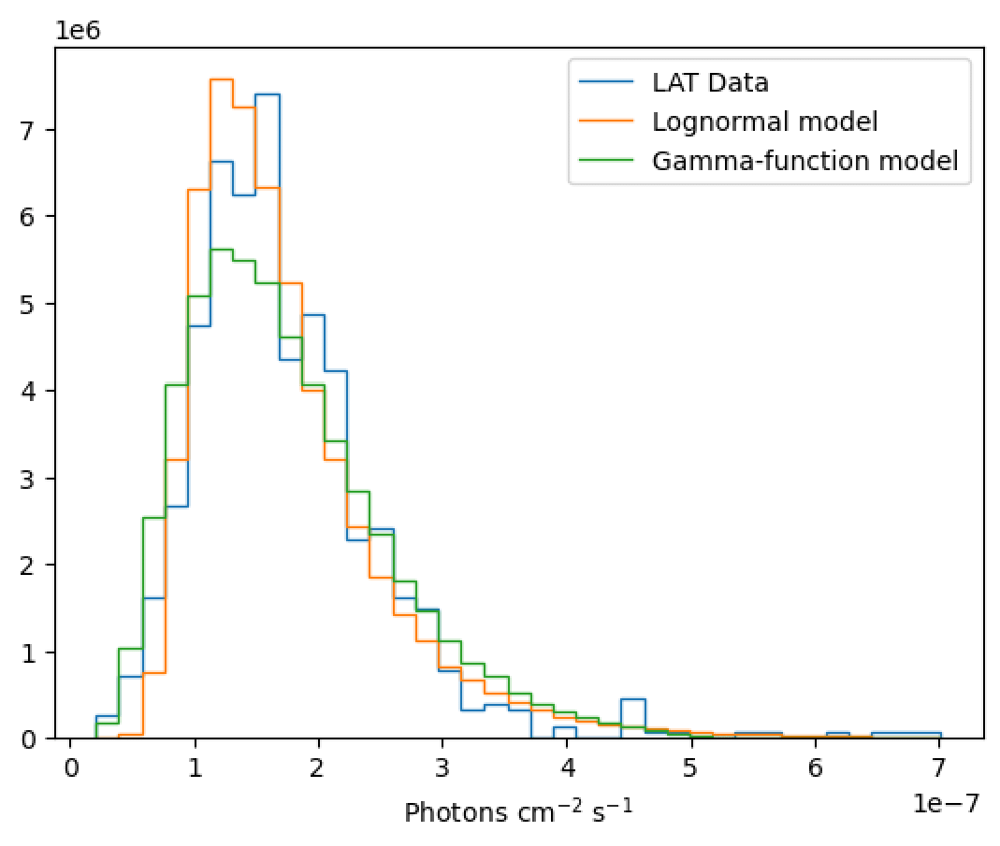

# Summary

Time-domain astrophysics plays a critical role in understanding the underlying physical processes of variable sources. In high-energy astrophysics, active galactic nuclei (AGNs) exhibit complex stochastic light curves that provide insights into accretion dynamics, jet physics, and emission mechanisms. `gammapy_SyLC` is an open-source Python package that offers a unified framework for simulating and fitting light curves in gamma-ray astronomy. It implements advanced algorithms for generating synthetic variability based on power spectral densities (PSDs) and probability density functions (PDFs) and provides Monte Carlo-based methods for robust statistical model fitting. `gammapy_SyLC` is not directly dependent on `gammapy` [@Donath2023], but is thought as a companion package focused on some aspects of time-domain high-energy astrophysics, with possible stronger integration.

# Statement of Need

Understanding the variability of AGNs is central to high-energy astrophysics. AGNs exhibit complex, stochastic light curves that encode information about accretion dynamics, relativistic jet activity, and particle acceleration processes. Variability studies allow us to probe the physical conditions in regions that are otherwise spatially unresolved, thereby offering unique insights into the underlying physics of these extreme objects.

Despite the importance of such studies, current approaches are often fragmented—researchers typically write custom code for simulating light curves, fitting PSDs, and analyzing PDFs of flux amplitudes. This fragmentation leads to redundant effort and potential inconsistencies in methodologies, making it difficult to compare results across different studies. There is a clear need for a standardized, open-source tool that integrates these processes into a single, user-friendly package.

`gammapy_SyLC` addresses these scientific needs by providing a unified framework for:
- **Simulating realistic light curves:** Utilizing both the Timmer & König and Emmanoulopoulos algorithms, the package can reproduce the temporal variability (PSD) and the statistical flux distribution (PDF) observed in AGNs.
- **Fitting variability models:** Through Monte Carlo-based methods, the package fits PSDs to determine the spectral index and tests different PDF models (e.g., lognormal, Gaussian, gamma) to characterize the amplitude distribution.
- **Performing hypothesis testing:** Dedicated functions allow for quantitative model selection, thereby enabling researchers to assess the significance of different statistical models in describing the observed variability.

This standardized tool is designed to be accessible to all researchers in the gamma-ray time-domain community, removing the need to reinvent the wheel and ensuring that analyses are reproducible and consistent across studies.

# Features and Methodology

## 1. Light Curve Simulation

### Timmer & König Algorithm

The Timmer & König (TK) algorithm [@Timmer1995] generates synthetic light curves by:
1. Creating Fourier components that match a specified PSD.
2. Randomizing the phases.
3. Performing an inverse Fourier transform.

This method ensures that the simulated light curve follows the target PSD, but it produces Gaussian-distributed flux values by design.

### Emmanoulopoulos Algorithm

The Emmanoulopoulos (EMM) algorithm [@Emmanoulopoulos2013] extends the TK method by matching both a specified PSD and a target flux amplitude distribution. In `gammapy_SyLC`, the EMM simulation is highly optimized and can generate a synthetic light curve in less than a millisecond for a typical 1000-point light curve. Its iterative process adjusts the flux values to reproduce a non-Gaussian distribution (e.g., lognormal), making it especially useful for modeling AGN variability.

### Optimization Strategies

The simulation routines incorporate several computational strategies:
- **Oversampling and Downsampling:** Synthetic light curves are first generated at a higher resolution (using a parameter such as `nchunks`, defaulting to 10) and then downsampled to reduce spectral leakage and edge effects.
- **Custom Noise Handling:** Users can introduce Gaussian or Poissonian noise to mimic observational uncertainties.
- **Efficient Iterative Correction:** The EMM algorithm typically converges within 10–20 iterations, yielding runtime of less than 1 ms per simulation for typical light curves.

{ width=1300px }

Figure 1: Comparison of TK and EMM simulated light curves, periodograms, and flux distributions.

## 2. Statistical Fitting Procedures

### Power Spectral Density (PSD) Fitting

PSD fitting is used to characterize stochastic variability. The PSD follows a power-law, \( P(f) \propto f^{-\alpha} \), where \(\alpha\) describes the temporal correlation structure of the light curve. The PSD fitting procedure in `gammapy_SyLC`:
1. Simulates multiple synthetic light curves with varying spectral indices.
2. Constructs statistical envelopes (e.g., 68% and 95% quantiles) from the ensemble periodograms.
3. Optimizes the best-fit spectral index using a likelihood-based approach with `scipy.optimize.minimize`.

For a typical 1000-point light curve, PSD fitting takes approximately 2–5 minutes, and if error estimation is required, the total runtime may extend to about 10 minutes.  

{ width=1000px }

Figure 2: Observed periodogram with statistical envelopes from simulated data for the Fermi-LAT observations of the AGN BL-LAC.

### Probability Density Function (PDF) Fitting

PDF fitting characterizes the flux amplitude distribution. The procedure in `gammapy_SyLC`:
1. Generates an empirical flux distribution from synthetic light curves that match the observed PSD.
2. Estimates the best-fit parameters for a chosen PDF model (e.g., lognormal) using a likelihood-based fitting routine.
3. Uses separate hypothesis testing functions (e.g., `test_norm` and `test_models`) to compare the lognormal model against alternative distributions such as Gaussian or gamma.

Typical PDF fitting runs take about 2–5 minutes, while running full hypothesis tests (e.g., 100 tests) can require around 20 minutes.

{ width=1000px }

Figure 3: Histogram of observed flux values with overlaid best-fit PDF models for the Fermi-LAT observations of the AGN Mkn-421.

## 3. Hypothesis Testing and Model Selection

To assess the goodness of fit for different PDF models, `gammapy_SyLC` includes dedicated hypothesis testing functions:
- **test_norm:** Compares the likelihood of the observed flux distribution against synthetic light curves generated assuming a normal distribution.
- **test_models:** Evaluates the performance of competing PDF models using likelihood ratio tests.

These tests provide a quantitative measure of model discrimination, ensuring that users can determine whether an AGN’s flux distribution is best described by, for example, a lognormal or Gaussian model.

## Typical Workflow

A typical workflow using `gammapy_SyLC` for a variability study might follow these steps:

1. **Data Acquisition:**  
   Retrieve the gamma-ray light curve from a repository (e.g., Fermi-LAT Light Curve Repository).

2. **Periodogram Estimation:**  
   Compute the periodogram of the observed light curve to characterize its frequency-domain properties.

3. **PSD Fitting:**  
   Fit a power-law model to the periodogram by simulating synthetic light curves and constructing statistical envelopes to estimate the best-fit spectral index.

4. **Light Curve Simulation:**  
   Generate synthetic light curves that match the fitted PSD and a chosen flux amplitude distribution using the Emmanoulopoulos algorithm.

5. **PDF Fitting and Model Selection:**  
   Construct an empirical PDF from the simulated flux values and compare the observed flux distribution with various candidate models (e.g., lognormal vs. Gaussian) using likelihood-based hypothesis tests.

6. **Scientific Interpretation:**  
   Combine the PSD and PDF fitting results to infer the physical processes driving the variability, such as turbulence in the accretion disk or fluctuations in jet emission.

## Note

An example of an application of the software can be found [on arxiv](https://arxiv.org/abs/2503.14156).

# References

